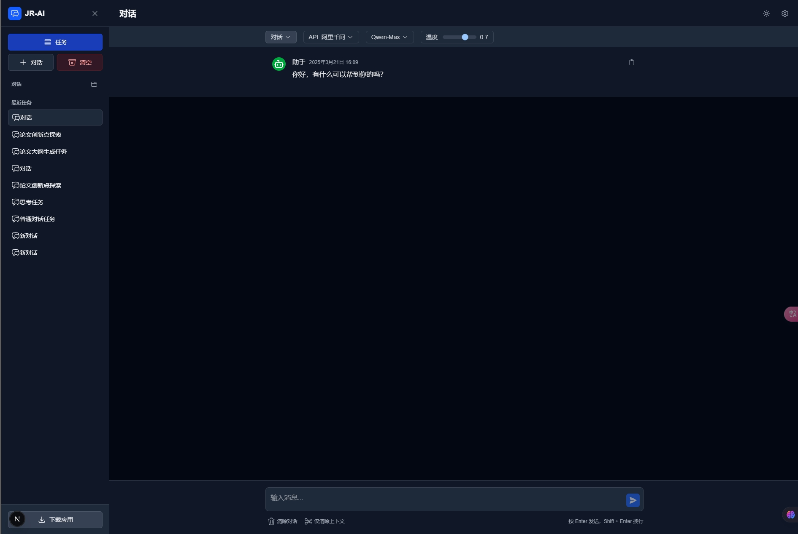

# ChatGPT UI

An advanced chat interface for AI models built with Next.js, featuring multiple specialized task types and a modern user experience.



## Features

- **Multiple Task Types**
  - General conversation mode
  - Deep thinking mode (powered by deepseek-r1)
  - Paper innovation exploration
  - Paper outline generation
  
- **Modern User Interface**
  - Clean and responsive design with dark/light mode
  - Code highlighting for programming languages
  - Markdown support for rich text formatting
  
- **Conversation Management**
  - Create and manage multiple conversations
  - Automatic conversation titling based on context
  
- **Advanced Capabilities**
  - Seamless integration with various AI models
  - API configuration options

## 项目简介 (Chinese Introduction)

这是一个基于Next.js构建的高级AI聊天界面，具有多种专业任务类型和现代用户体验。

### 主要功能

- 支持多种任务类型：普通对话、深度思考、论文创新点探索、论文大纲生成等
- 现代化用户界面：支持深色/浅色模式、代码高亮、Markdown渲染
- 会话管理：创建和管理多个会话，自动根据上下文生成会话标题
- 高级功能：与各种AI模型的无缝集成，API配置选项

开始使用只需安装依赖并运行开发服务器，详见上方英文说明。


## Getting Started

First, install the dependencies:

```bash
npm install
# or
yarn install
# or
pnpm install
```

Then, run the development server:

```bash
npm run dev
# or
yarn dev
# or
pnpm dev
# or
bun dev
```

Open [http://localhost:3000](http://localhost:3000) with your browser to see the result.

## Architecture

The project is built with:

- **Next.js 15** - React framework with server-side rendering
- **React 19** - UI library
- **Tailwind CSS 4** - Utility-first CSS framework
- **Zustand** - State management
- **OpenAI API** - AI model integration

## Project Structure

- `src/app` - Main application pages
- `src/components` - Reusable UI components
  - `chat` - Chat interface components
  - `layout` - Layout components
  - `task` - Task-specific components
  - `ui` - Basic UI elements
- `src/store` - State management
- `src/utils` - Utility functions
- `src/types` - TypeScript type definitions

## Deployment

The easiest way to deploy this application is using the [Vercel Platform](https://vercel.com/new) from the creators of Next.js.

For more information on deployment options, check out the [Next.js deployment documentation](https://nextjs.org/docs/app/building-your-application/deploying).

## Contributing

Contributions are welcome! Please feel free to submit a Pull Request.

## License

This project is licensed under the MIT License - see the LICENSE file for details.

---
